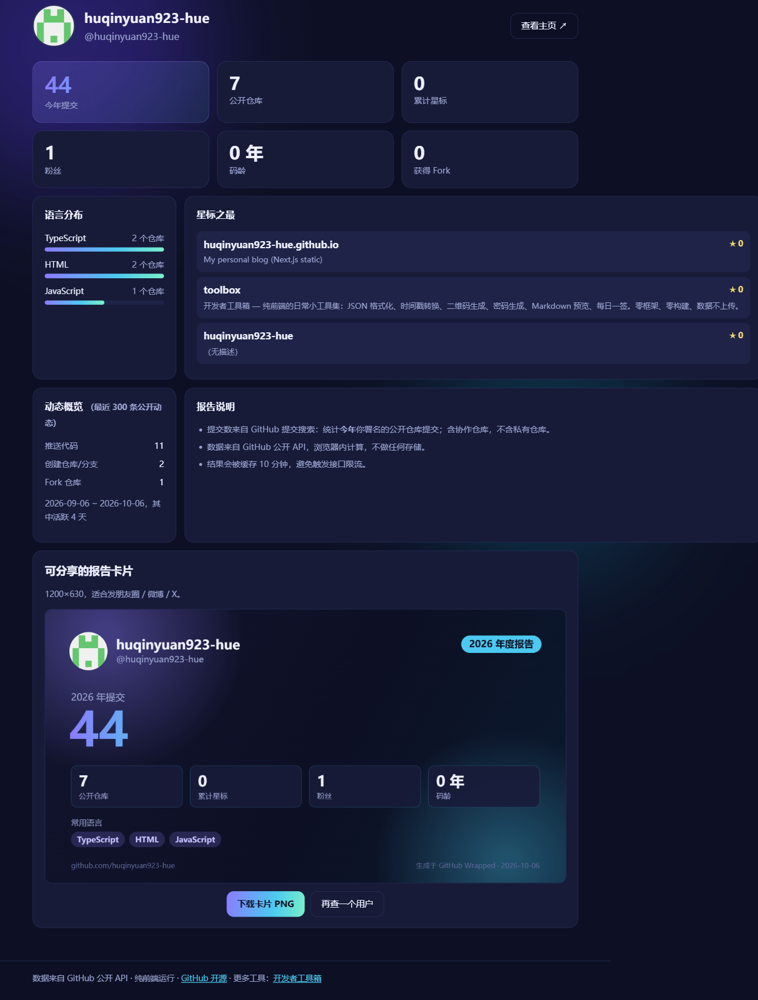

# 🎁 GitHub 年度报告 · Wrapped

输入 GitHub 用户名，**10 秒生成你的年度报告**：今年提交（估算）、星标、语言分布、动态概览，并下载一张 1200×630 的可分享报告卡片。

**在线使用 → <https://wrapped.adcakeyuan.top/>**

支持 `?u=用户名` 直达，例如：
`https://wrapped.adcakeyuan.top/?u=torvalds`

## ✨ 特性

- **零依赖、零构建**：HTML + CSS + 原生 JS，图表全部手绘（DOM 条形图 + Canvas 卡片）
- **纯前端**：数据来自 GitHub 公开 API，浏览器内计算，不收集任何信息
- **可分享卡片**：Canvas 绘制 1200×630 渐变卡片，一键下载 PNG
- **健壮性**：
  - 接口结果缓存 10 分钟（sessionStorage），避免触发 60 次/小时的未认证限流
  - 明确区分「用户不存在」「接口限流（含恢复时间）」「网络异常」三类错误
  - `stats/participation` 的 202 异步统计自动重试
  - 头像绘制失败自动降级为首字母徽标
  - 所有 API 返回的文本（仓库名、描述等）均以 `textContent` 渲染，无 XSS 注入面

## 📊 统计口径说明

| 指标 | 口径 |
|---|---|
| 今年提交 | GitHub 提交搜索（Search Commits）：今年内你署名的公开仓库提交总数，含协作仓库、不含私有仓库 |
| 累计星标 / Fork | 全部公开仓库（含 fork）求和 |
| 语言分布 | 原创仓库的主语言计数，取前 6 |
| 动态概览 | 最近 300 条公开事件分类统计 |

## 🚀 部署

纯静态站点：仓库 Settings → Pages → 选择 `main` 分支根目录。

## 📄 License

[MIT](LICENSE)
